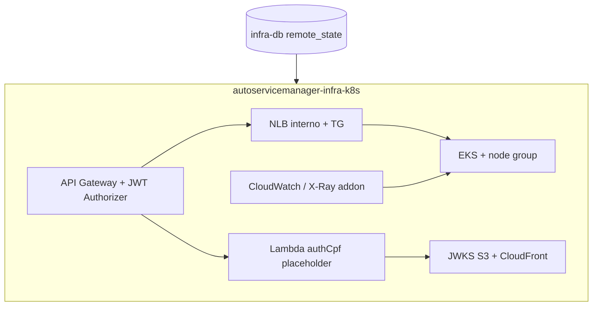

# autoservicemanager-infra-k8s

Terraform do stack **compute/edge** (Fase 3): EKS, NLB, VPC Link, API Gateway HTTP API, JWT Authorizer, Lambda authCpf, JWKS (S3+CloudFront), IRSA e observabilidade.

Repositório standalone (pós-cisão). Consome `terraform_remote_state` do [autoservicemanager-infra-db](https://github.com/dinhogt/autoservicemanager-infra-db) (ADR-008).

**Docs:** [RFC-001](https://github.com/dinhogt/autoservicemanager-app/blob/develop/docs/architecture/rfc-001-cloud-aws.md) · [ADR-004](https://github.com/dinhogt/autoservicemanager-app/blob/develop/docs/architecture/adr-004-api-gateway-vpc-link.md)–[009](https://github.com/dinhogt/autoservicemanager-app/blob/develop/docs/architecture/adr-009-github-oidc-aws-iam.md) · [obs](https://github.com/dinhogt/autoservicemanager-app/tree/develop/docs/observability) · [runbook](https://github.com/dinhogt/autoservicemanager-app/blob/develop/docs/runbook.md)

## Escopo neste repo



| Recurso | Detalhe |
|---------|---------|
| Remote state | Lê `db/<homolog\|prod>/terraform.tfstate` |
| EKS | Kubernetes 1.34, node `t3.medium` |
| API Gateway | `POST /auth/cpf` → Lambda; rotas cliente com JWT; admin/health sem RS256 |
| Lambda | Placeholder no plan; código real via CI [auth-lambda](https://github.com/dinhogt/autoservicemanager-auth-lambda) |
| Observabilidade | Addon CloudWatch observability, dashboards, alarmes SNS |

## Pré-requisitos

1. Bootstrap state (mesmo do infra-db)
2. **infra-db apply** no ambiente
3. Terraform >= 1.5, Node 22 (JWKS), AWS CLI

## Apply local

```bash
cp backend.hcl.example backend.hcl
cp terraform.tfvars.example terraform.tfvars
terraform init -backend-config=backend.hcl
TF_VAR_environment=homolog TF_VAR_tf_state_bucket=... terraform apply
```

## Pós-apply

1. Anotar IRSA ARNs nos ServiceAccounts do [app](https://github.com/dinhogt/autoservicemanager-app)
2. Registrar pods no `target_group_arn`
3. Secret `AUTH_LAMBDA_NAME` no repo auth-lambda
4. Assinar SNS de alertas (docs obs no app)

Swagger / Postman: [app README](https://github.com/dinhogt/autoservicemanager-app#documentação-da-api-swagger).

## CI/CD (OIDC)

Workflows: [`.github/workflows/ci-cd.yml`](.github/workflows/ci-cd.yml) + [`security-gate.yml`](.github/workflows/security-gate.yml).

| Evento | Ação |
|--------|------|
| PR | `security-gate` → `fmt` + `validate` — **sem AWS** |
| Push `develop` | OIDC → plan/apply; key `k8s/homolog/` (aguarda state db) |
| Push `master` | OIDC → plan/apply; key `k8s/prod/` |

Secrets: `AWS_ROLE_ARN`. Var opcional: `TF_STATE_BUCKET`. Sem path filters de monorepo.

## Destroy

Destruir **este stack antes** do [infra-db](https://github.com/dinhogt/autoservicemanager-infra-db).

## Outputs principais

`api_endpoint`, `jwt_issuer`, `eks_cluster_name`, `auth_lambda_name`, `target_group_arn`, `app_irsa_role_arn`, `ops_alerts_topic_arn`, `ops_dashboard_name`
