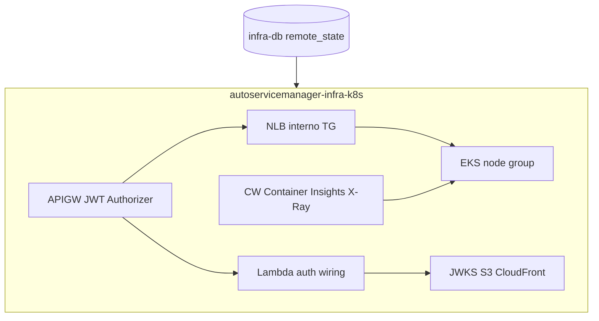

# autoservicemanager-infra-k8s

## Propósito

Infraestrutura como código do **cluster Kubernetes**, **API Gateway**, wiring da Lambda de auth, JWKS e **observabilidade** (Fase 3). Consome outputs do [infra-db](https://github.com/dinhogt/autoservicemanager-infra-db) via remote state (ADR-008).

## Tecnologias

Terraform ≥ 1.5  · EKS  · API Gateway HTTP API  · NLB / VPC Link  · Lambda  · CloudWatch / X-Ray / Container Insights  · GitHub Actions OIDC

**Docs canônicos (app):** [delivery-index](https://github.com/dinhogt/autoservicemanager-app/blob/develop/docs/architecture/delivery-index.md) · [RFC-001](https://github.com/dinhogt/autoservicemanager-app/blob/develop/docs/architecture/rfc-001-cloud-aws.md) · [ADR-004](https://github.com/dinhogt/autoservicemanager-app/blob/develop/docs/architecture/adr-004-api-gateway-vpc-link.md) · [ADR-011](https://github.com/dinhogt/autoservicemanager-app/blob/develop/docs/architecture/adr-011-sync-rest-api-gateway.md) · [obs](https://github.com/dinhogt/autoservicemanager-app/tree/develop/docs/observability)

## Escopo neste repo (diagrama)



| Recurso | Detalhe |
|---------|---------|
| Remote state | Lê `db/<homolog\|prod>/terraform.tfstate` |
| EKS | Kubernetes 1.34, node `t3.medium` |
| API Gateway | `POST /auth/cpf` → Lambda; rotas cliente com JWT; admin/health sem RS256 |
| Lambda | Placeholder no plan; código real via CI [auth-lambda](https://github.com/dinhogt/autoservicemanager-auth-lambda) (auth-cpf + notify-os) |
| SNS | `os-notifications` → Lambda notify-os → SES |
| Observabilidade | Addon CloudWatch observability, dashboards (OS volume, fases, CPU/mem), alarmes SNS (ADR-012) |

## Pré-requisitos

1. Bootstrap state (mesmo do infra-db)
2. **infra-db apply** no ambiente
3. Terraform >= 1.5, Node 22 (JWKS), AWS CLI

## Apply local

```bash
cp backend.hcl.example backend.hcl
cp terraform.tfvars.example terraform.tfvars
terraform init -backend-config=backend.hcl
TF_VAR_environment=homolog TF_VAR_tf_state_bucket=... terraform apply
```

## Pós-apply

1. Anotar IRSA ARNs nos ServiceAccounts do [app](https://github.com/dinhogt/autoservicemanager-app)
2. Registrar pods no `target_group_arn`
3. Secrets `AUTH_LAMBDA_NAME` + `NOTIFY_LAMBDA_NAME` no repo auth-lambda
4. ConfigMap/Secret `OS_NOTIFICATIONS_TOPIC_ARN` no app
5. Assinar SNS de alertas (docs obs no app)

Swagger / Postman: [app README](https://github.com/dinhogt/autoservicemanager-app#documentação-da-api-swagger).

## CI/CD (OIDC)

Workflows: [`.github/workflows/ci-cd.yml`](.github/workflows/ci-cd.yml) + [`security-gate.yml`](.github/workflows/security-gate.yml).

| Evento | Ação |
|--------|------|
| PR (só `.tf` / modules / workflows) | `security-gate` ∥ `fmt` + `validate` — **sem AWS** |
| Push `develop` | OIDC → plan/apply; key `k8s/homolog/` (fail-fast se state db ausente) |
| Push `master` | OIDC → plan/apply; key `k8s/prod/` |

**Proteção:** `master` só via Pull Request; deploys automáticos em `develop`/`master`. Secrets: `AWS_ROLE_ARN`. Cache de providers; wait do remote state limitado a ~30s.

## Destroy

Destruir **este stack antes** do [infra-db](https://github.com/dinhogt/autoservicemanager-infra-db).

## Outputs principais

`api_endpoint`, `jwt_issuer`, `eks_cluster_name`, `auth_lambda_name`, `notify_lambda_name`, `os_notifications_topic_arn`, `target_group_arn`, `app_irsa_role_arn`, `ops_alerts_topic_arn`, `ops_dashboard_name`
